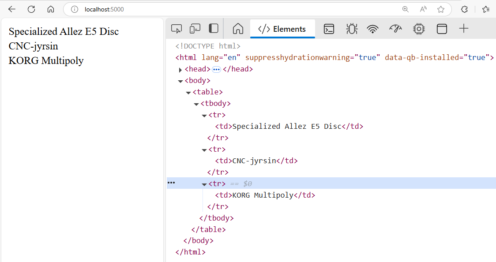

# Kurssin harjoitustyö

**Harjoitustyö** on nelivaiheinen. Täydet pisteet saa toteuttamalla kaikki 4 osioita. Tehtävänanto täydentyy esimerkeillä ja täsmennyksillä luentojen yhteydessä.

Alla vaiheiden 1-3 käyttöliittymä (saa tehdä hienommankin)




1. Tee Flask-sovellus joka lukee tiedostosta lahjatoiveiden nimet, ja tulostaa ne HTML-taulukossa
   - [Täältä vinkki](https://www.w3schools.com/html/html_tables.asp)
2. Flask sovellus lukee CSV-tiedostosta lahjatoiveiden nimen, kuvauksen sekä kuvapolun ja tulostaa ne HTML-taulukossa
   - Tässä voi käyttää vaihe 4:n tehtäväpohjan CSV-tiedostoa mallina
3. Flask sovellus lukee CSV-tiedostosta edelliset, muuntaa lahjatoivetiedot JSON-muotoon ja tarjoilee niitä niitä JSON-formaatissa HTTP-rajapinnan yli. Tässä pitää perehtyä hieman JavaScript-selainohjelmointiin. Vaiheen 4 index.html-koodista voi ottaa mallia.
4. Edellisen lisäksi, uusia lahjatoiveita pystyy tallentamaan tiedostoon. Myös kuvan lataaminen ja toiveen poistaminen pitää olla mahdollista.

Vaiheeseen1 löytyy esimerkki [täältä](https://github.com/mjpanula/ohpe-genai/tree/main/harjoitusty%C3%B6/vaihe1). [zip-paketti](https://github.com/mjpanula/ohpe-genai/raw/refs/heads/main/harjoitusty%C3%B6/vaihe1.zip).

Vaiheeseen 4 löytyy esimerkki [täältä](https://github.com/mjpanula/ohpe-genai/tree/main/harjoitusty%C3%B6/vaihe4). [zip-paketti](https://github.com/mjpanula/ohpe-genai/raw/refs/heads/main/harjoitusty%C3%B6/vaihe4.zip). Vaihe 4:n esimerkki ei sinällään toimi, siitä on tarkoituksella poistettu `omat_funktiot.py`-moduuli joka sisältää funktiot `lue_toiveet`, `generoi_toiveet_csv_rivi` ja `ylikirjoita_toiveet_csv`. Mikäli haluat toteuttaa harjoitustyön tämän pohjan avulla, tehtäväksesi jää näiden funktioiden toiminnallisuuden toteuttaminen pohjaan.

**Aikataulu**. Palautetut työt arvioidaan perjantaina 13. kesäkuuta. Mikäli palautettavien töiden (harjoitustyö ja itsearviointi) palautus viivästyy tästä, venyy arviointi Elokuulle.

[Tehtävä palautetaan ZIP-pakattuna moodleen.](https://moodle.seamk.fi/mod/assign/view.php?id=1400266) Jokainen vaihe tulee löytyä omana hakemistonaan. Alla oleva on vain esimerkki. Tärkeintä on palautat kaikki tekemäsi versiot omissa hakemistoissaan itsenäisinä ohjelmina.

```
harjoitustyö.zip

harjoitustyö/
├── vaihe1/
│   ├── toiveet.txt
│   ├── index.html
│   └── app.py
├── vaihe2/
│   ├── toiveet.csv
│   ├── index.html
│   └── app.py
├── vaihe3/
│   ├── toiveet.csv
│   ├── index.html
│   └── app.py
└── vaihe4/
    ├── toiveet.csv
    ├── app.py
    ├── add_wish.html
    └── index.html
```